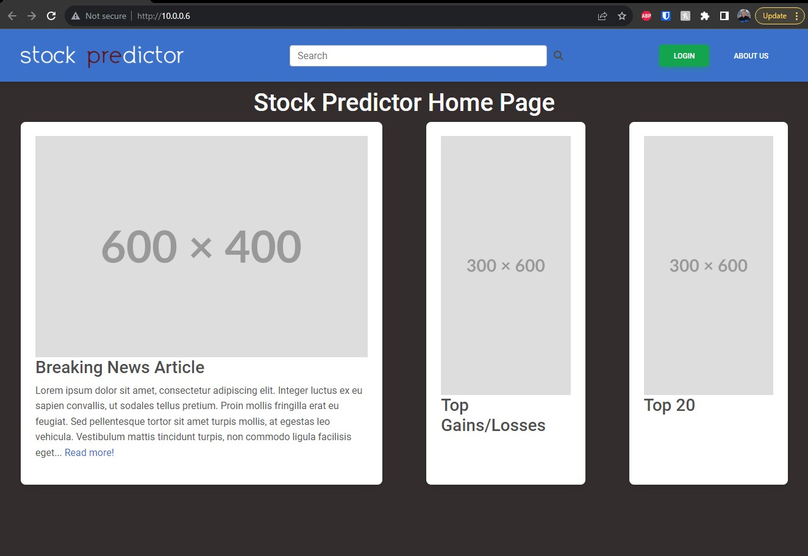

Over this past summer I've been working on a stock analysis program alongside a few friends which will utlize artificial intelligence in order to analyze historical stock values, and current news headlines in order to make predictions on future movements of that specific stock. The plan is to utlize machine learning algorithms in order to analyze markers and patterns in historical data to predict future movement, while also developing a webscraper to pull news articles to see if they potray the company in the positive/negative light in order to gauge public semtiment.

## My Current Contributions

I took inititive by designing an initital web server/interface written on python and written in flask. This includes a home screen as well as dynamically generated pages for whatever stock a user chooses. These dynamically generated pages will have a table with the historical stock data from yahoo finance alongside top news headlines and our analysis on the future movement, as well as an opinion the the sentiment of professionals and the public towards that specific stock and company. 

## Planned Contributions

I plan on implementing user acounts through firebase where users can add stocks to a watch list, and potentially put in their currrent positions in order to be notified when major developments occur in the market or that specific stock in order to prompt the user to increase/decrease their positon. 

In addition to the front-end I plan on assisting on the backend on data collectiona and manipulation as well as the AI applying recently learned skills from the AI class I took this past Spring.