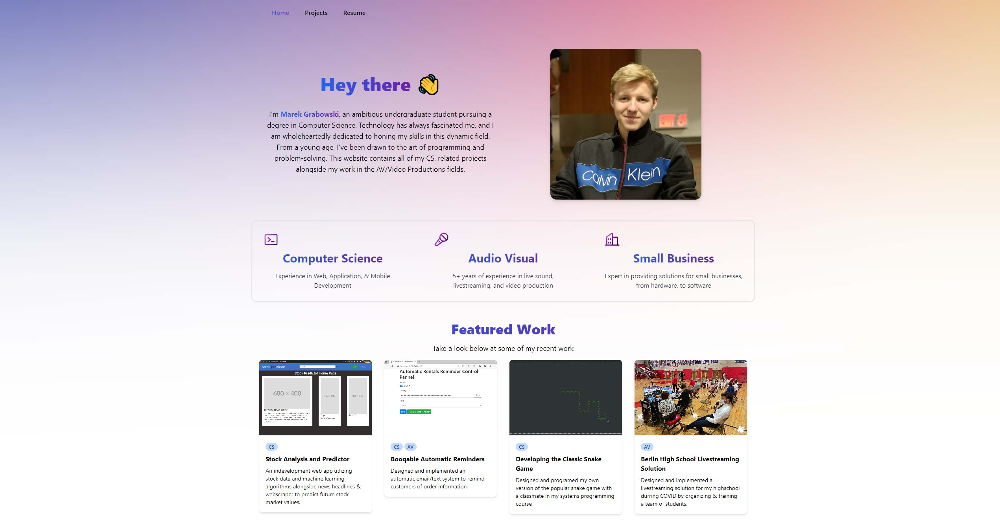

At the end of this summer I've been working on replacing my older templete based website, with a new one built from the ground up on AstroJS, a modern all-in-one framework with server-side rendering for incredible speed. I've utlized the built in frontmatter cms for my projects page, and using tailwindcss for styling.

## Why redo my site?

I decided to redesign my website this summer partailly as prep for a web development class, but also to update and redesign my old website which I've had since high school. I found this the perfect oppertunity to learn some newer technologies and frameworks compared to my old website which was entirely markup, css, and javascript of which most was from a template from HTML5UP. Due to poor optimization on my part this website had become slow with the amount of embeded photos and videos.

## What I've learned

Through the past few weeks, I've developed a level of confornt on creating and deploying websites on the Astro framework on Github Pages. In addition to astro I decided to also utlize Tailwind CSS as I already had a basic understanding of CSS, and wanted to try something new in hopes I would prefer it, which I did. The modular design of astro, both with features, and webpage design made is very easy to make elements once, and utlize them multiple times throughout the website, instead of copy pasting code. I still have some features I want to work on over the next few weeks, such as implementing a website wide dark mode, which also detects the users preference on their device, along side flushing out my projects blog pages, and potentially adding a unrelated personal blog. I may also start experimenting with React and try to implement a cool looking "loading" animation when a user visits the website for the first time in their session.